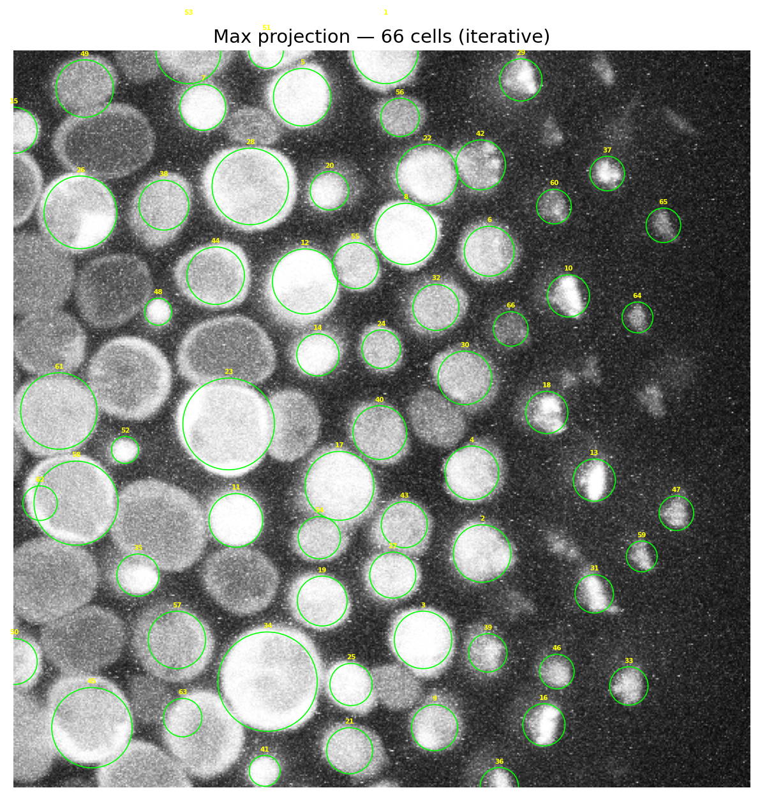
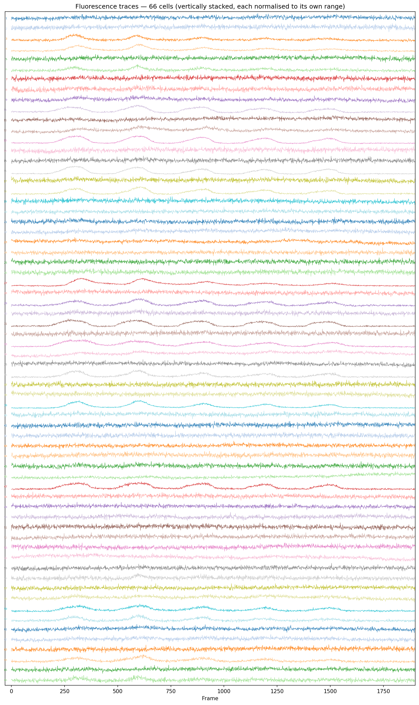

# Fluorescence Cell Imaging Pipeline

An automated pipeline for detecting, segmenting, and extracting fluorescence traces from biological cell imaging videos (multi-frame TIFF stacks). Includes an interactive GUI for manual ROI correction.

---

## Requirements

Python 3.10+ with the packages listed in `requirements.txt`:

```
imageio>=2.28
imageio-ffmpeg>=0.4
matplotlib>=3.7
numpy>=1.24
opencv-python-headless>=4.8
scikit-image>=0.21
scipy>=1.11
tifffile>=2023.1
```

---

## Setup

```bash
./setup_env.sh
```

This creates a local `venv/` directory and installs all dependencies in isolation from any system Python or Anaconda environment.

---

## Usage

### 1 — Run the full pipeline

```bash
./run.sh path/to/your_imaging_file.tif
```

Optional: specify a custom output directory (defaults to the same folder as the TIFF):

```bash
./run.sh path/to/your_imaging_file.tif --outdir path/to/output
```

### 2 — Manually correct ROIs with the GUI

After the pipeline runs, launch the interactive editor to add or remove cells:

```bash
python cell_editor_gui.py path/to/your_imaging_file.tif
```

Pass a specific labeled mask to edit (otherwise the most recent `output_YYYY-MM-DD/labeled_mask.npy` is loaded automatically):

```bash
python cell_editor_gui.py path/to/your_imaging_file.tif path/to/labeled_mask.npy
```

**GUI controls:**

| Key / Action | Behaviour |
|---|---|
| `d` | Delete mode — click inside a cell to remove it |
| `a` | Add mode — click 4 boundary points to define a new elliptical ROI |
| `z` | Undo last add or delete (up to 50 steps) |
| `s` | Save & re-run pipeline → new `output_YYYY-MM-DD/` folder |
| `Esc` | Cancel an in-progress add |

---

## Pipeline overview

| Step | Description |
|---|---|
| **1 — Load** | Read TIFF stack → temporal max projection → normalise to [0, 1] |
| **2 — Calibrate** | Interactive: click 4 boundary points on the largest cell, then 4 on the smallest. PCA ellipse fitting derives LoG sigma bounds. |
| **3 — Detect** | Iterative LoG with masked subtraction: each pass masks out found cells and re-runs LoG to catch shadowed neighbours. |
| **4 — Masks** | Build binary `(N_cells, H, W)` mask array from the labeled image. |
| **5 — Traces** | Extract per-cell mean fluorescence intensity for every frame → `(N_frames, N_cells)` array. |
| **6 — Video** | Render overlay video with labelled cell outlines at 10 fps. |
| **7 — Summary** | 4-panel validation figure: raw frame 0, max projection, detected cells, fluorescence traces. |

---

## Example outputs

### Detection overlay (max projection with all cell outlines)


### Fluorescence traces (all cells, stacked waterfall)


---

## Output files

All outputs are written to the same directory as the input TIFF (or `--outdir`):

| File | Description |
|---|---|
| `labeled_mask.npy` | `(H, W)` int32 array — pixel value = cell index (1…N), 0 = background |
| `cell_masks.npy` | `(N_cells, H, W)` bool array — one binary mask per cell |
| `fluorescence_traces.npy` | `(N_frames, N_cells)` float64 array of mean intensities |
| `fluorescence_traces.png` | Vertically stacked waterfall plot of all traces |
| `blobs_overlay_all.png` | Static max-projection overlay with cell outlines |
| `blobs_overlay_all.mp4` | Full video with cell outlines at 10 fps |
| `validation_summary.png` | 4-panel summary figure |
| `diag_1_after_log.png` | Debug: actual pixel masks immediately after detection |

The GUI additionally saves per-run outputs into dated folders:

```
output_YYYY-MM-DD/
  labeled_mask.npy
  cell_masks.npy
  fluorescence_traces.npy
  fluorescence_traces.png
  blobs_overlay.mp4
  shape_params.npy
  cell_ids.npy
```

---

## Notes

- **`venv/`**, raw **`.tif`** files, **`.npy`** arrays, and **`.mp4`** videos are all gitignored — only source code and sample PNGs are tracked.
- The pipeline uses the macOS `MacOSX` matplotlib backend for interactive calibration clicks. On Linux, change `matplotlib.use("MacOSX")` to `matplotlib.use("TkAgg")` in both `SigProcessingPipeline.py` and `cell_editor_gui.py`.
- If you use Anaconda, the `./run.sh` wrapper automatically clears `PYTHONPATH` and `PYTHONHOME` to prevent package conflicts.
